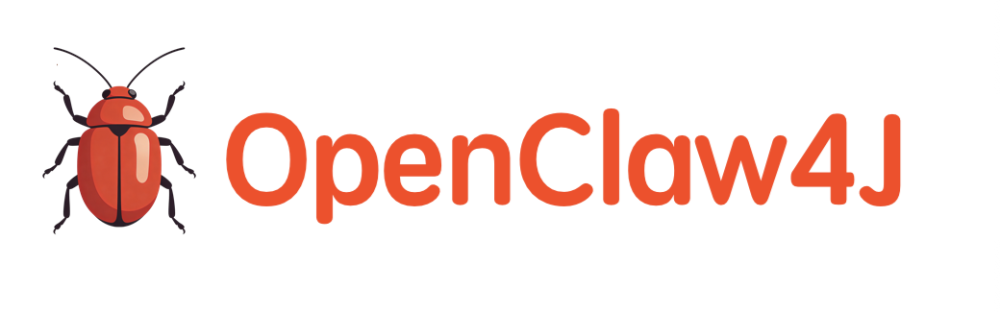

# OpenClaw4J

<p align="center">
  
</p>

<p align="center">
    
    
    
    
    
</p>

[中文](#中文) | [English](#english)

---

<a name="中文"></a>
## 🇨🇳 中文介绍

**OpenClaw4J** 是一个基于 Java 17 和 **Spring AI** 构建的现代智能 Agent 框架。受到 OpenClaw 项目（开源精神与经典重构）的启发，本项目的目标是为 Java 开发者提供一个灵活、可扩展且功能强大的 AI 机器人/Agent 开发底座。

它不仅集成了先进的 LLM（如 DeepSeek），还通过 **RAG（检索增强生成）** 和 **混合技能系统（Java + Python）** 赋予了 Agent 真实的行动能力，支持多平台（Telegram、Teammors）接入。

### ✨ 主要特点 (Features)

*   **多平台支持**：内置 Telegram Bot 和 Teammors 机器人适配器，一套核心逻辑，多端服务。
*   **AI 核心驱动**：基于 **Spring AI** 框架，默认集成 **DeepSeek** 大模型，支持流式对话与上下文理解。
*   **RAG 知识库**：
    *   内置 `SimpleVectorStore`（基于文件的向量存储），无需复杂的向量数据库部署即可实现轻量级 RAG。
    *   支持本地知识检索，增强回答准确性。
*   **混合技能系统 (Hybrid Skill System)**：
    *   创新性地结合 Java 的稳健性与 Python 的生态丰富性。
    *   支持 Java 调用 Python 脚本作为 "Skill"（技能），轻松扩展如 **浏览器自动化 (Browser Automation)**、**加密货币价格查询**、**邮件处理**、**系统状态监控** 等能力。
*   **企业级架构**：基于 Spring Boot 3.3，集成 Redis 缓存，具备良好的扩展性和维护性。

### 🎯 项目目标 (Goals)

参考 **OpenClaw** 的精神，本项目致力于：
1.  **开箱即用**：提供一个配置简单、依赖清晰的 Java AI Agent 启动模板。
2.  **能力扩展**：通过标准化的 Skill 接口，让开发者可以轻松接入各种外部工具（Tools/Plugins）。
3.  **连接现实**：不仅是聊天机器人，更是能执行任务（查邮件、看网页、监控系统）的智能助手。

### 🚀 快速开始 (Getting Started)

#### 1. 环境要求
*   **Java**: JDK 17+
*   **Maven**: 3.6+
*   **Redis**: 用于缓存和数据存储
*   **Python**: 3.8+ (用于运行 Python 技能脚本)

#### 2. 配置应用
修改 `src/main/resources/application.yml` 文件，填入你的配置信息：

> 💡 **获取 Token**: 关于如何获取 `Teammorsbot Token` 和 `Telegrambot Token`，请访问帮助文档：[https://www.teammors.top/openclaw4j/](https://www.teammors.top/openclaw4j/)
>
> 📧 **邮件技能配置**: 如果需要使用发送邮件功能，请阅读 [skills/send-email/SKILL.md](skills/send-email/SKILL.md) 并配置相应的邮箱账号信息。

```yaml
spring:
  ai:
    openai:
      api-key: your-deepseek-api-key # DeepSeek API Key
      base-url: https://api.deepseek.com

telegram:
  id: your-telegram-bot-id
  token: your-telegram-bot-token
  name: your-bot-username

redis:
  ip: localhost
  port: 6379
  password: your-redis-password
```

#### 3. 安装 Python 依赖
项目中的技能位于 `skills/` 目录下。请确保你的环境安装了相关 Python 库（视具体使用的技能而定）：

```bash
pip install requests beautifulsoup4 selenium psutil
```

#### 4. 运行项目
```bash
# 编译打包
mvn clean package

# 运行
java -jar target/OpenClaw4J-1.0.jar
```
或者直接使用 IDE (IntelliJ IDEA) 运行 `OpenClaw4JApplication.java`。

---

<a name="english"></a>
## 🇺🇸 English Introduction

**OpenClaw4J** is a modern intelligent Agent framework built on Java 17 and **Spring AI**. Inspired by the OpenClaw project (with its spirit of open source and classic reimplementation), this project aims to provide a flexible, extensible, and powerful foundation for Java developers to build AI Bots and Agents.

It integrates advanced LLMs (like DeepSeek) and empowers agents with real-world capabilities through **RAG (Retrieval-Augmented Generation)** and a **Hybrid Skill System (Java + Python)**, supporting multi-platform (Telegram, Teammors) connectivity.

### ✨ Key Features

*   **Multi-Platform Support**: Built-in adapters for Telegram Bot and Teammors, serving multiple endpoints with a single core logic.
*   **AI-Driven Core**: Powered by **Spring AI**, integrated with **DeepSeek** LLM by default, supporting streaming conversation and context understanding.
*   **RAG (Retrieval-Augmented Generation)**:
    *   Includes `SimpleVectorStore` (file-based vector storage) for lightweight RAG without complex vector database deployment.
    *   Supports local knowledge retrieval to enhance answer accuracy.
*   **Hybrid Skill System**:
    *   Innovatively combines the robustness of Java with the rich ecosystem of Python.
    *   Supports Java invoking Python scripts as "Skills", easily extending capabilities like **Browser Automation**, **Crypto Price Checking**, **Email Processing**, and **System Status Monitoring**.
*   **Enterprise Architecture**: Built on Spring Boot 3.3 and Redis, ensuring scalability and maintainability.

### 🎯 Goals

Referencing the spirit of **OpenClaw**, this project aims to:
1.  **Out-of-the-Box**: Provide a Java AI Agent template that is simple to configure and easy to start.
2.  **Extensibility**: Enable developers to easily integrate various external tools/plugins via a standardized Skill interface.
3.  **Real-World Connection**: Go beyond a chatbot to create an intelligent assistant capable of executing tasks (checking emails, browsing the web, monitoring systems).

### 🚀 Getting Started

#### 1. Prerequisites
*   **Java**: JDK 17+
*   **Maven**: 3.6+
*   **Redis**: For caching and data storage
*   **Python**: 3.8+ (For running Python skill scripts)

#### 2. Configuration
Update `src/main/resources/application.yml` with your credentials:

> 💡 **Get Tokens**: For instructions on how to obtain `Teammorsbot Token` and `Telegrambot Token`, please visit the help documentation: [https://www.teammors.top/openclaw4j/](https://www.teammors.top/openclaw4j/)
>
> 📧 **Email Skill Configuration**: If you need to use the email sending capability, please refer to [skills/send-email/SKILL.md](skills/send-email/SKILL.md) and configure the corresponding email account credentials.

```yaml
spring:
  ai:
    openai:
      api-key: your-deepseek-api-key # DeepSeek API Key
      base-url: https://api.deepseek.com

telegram:
  id: your-telegram-bot-id
  token: your-telegram-bot-token
  name: your-bot-username

redis:
  ip: localhost
  port: 6379
  password: your-redis-password
```

#### 3. Install Python Dependencies
Skills are located in the `skills/` directory. Ensure your environment has the necessary Python libraries installed (depending on the skills you use):

```bash
pip install requests beautifulsoup4 selenium psutil
```

#### 4. Run the Application
```bash
# Build
mvn clean package

# Run
java -jar target/OpenClaw4J-1.0.jar
```
Or run `OpenClaw4JApplication.java` directly from your IDE (IntelliJ IDEA).

---

## 📄 License

This project is licensed under the MIT License - see the [LICENSE](LICENSE) file for details.

