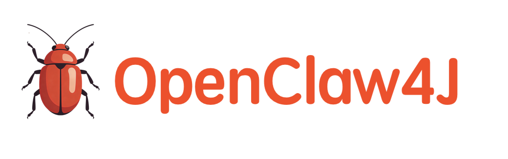
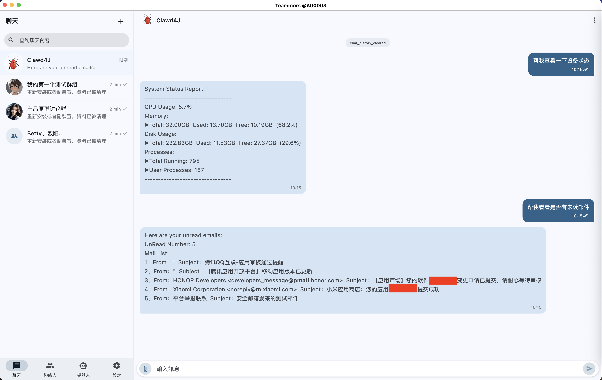
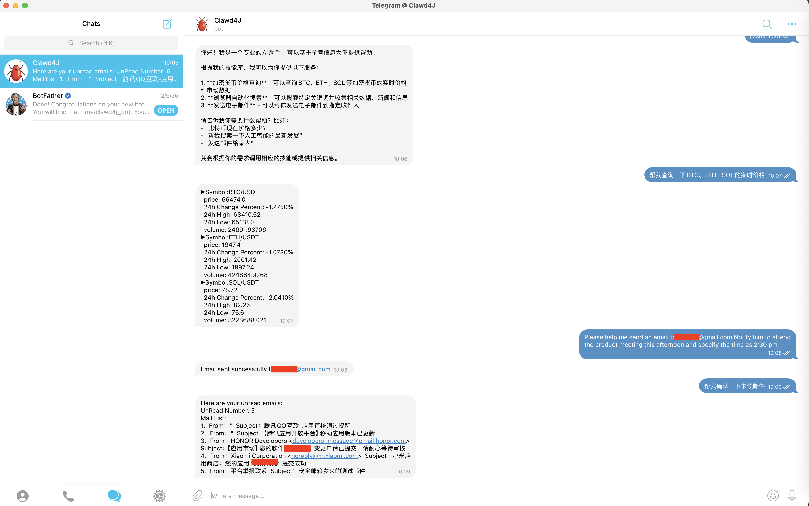

# OpenClaw4J

<p align="center">
  
</p>

<p align="center">
    
    
    
    
    
    
    
</p>

[中文](#中文) | [English](#english)

---

<a name="中文"></a>
## 🇨🇳 中文介绍

**OpenClaw4J** 是一个基于 Java 21 和 **Spring AI** 构建的现代智能 Agent 框架。受到 OpenClaw 项目（开源精神与经典重构）的启发，本项目的目标是为 Java 开发者提供一个灵活、可扩展且功能强大的 AI 机器人/Agent 开发底座。

它不仅集成了先进的 LLM（如 DeepSeek），**还通过 **RAG（检索增强生成）**** 和 **混合技能系统（Java + Python）** 赋予了 Agent 真实的行动能力，支持多平台（Telegram、Teammors）接入。

### ✨ 主要特点 (Features)

*   **多平台支持**：内置 Telegram Bot 和 Teammors 机器人适配器，一套核心逻辑，多端服务。
*   **AI 核心驱动**：基于 **Spring AI** 框架，默认集成 **DeepSeek** 大模型，支持流式对话与上下文理解。
*   **RAG 知识库**：
    *   内置 `SimpleVectorStore`（基于文件的向量存储），无需复杂的向量数据库部署即可实现轻量级 RAG。
    *   支持本地知识检索，增强回答准确性。
    *   **Token 优化**：引入 RAG 技术可极大地降低 Token 的使用数量，避免类似 OpenClaw 那样消耗大量的 Token。
*   **混合技能系统 (Hybrid Skill System)**：
    *   创新性地结合 Java 的稳健性与 Python 的生态丰富性。
    *   支持 Java 调用 Python 脚本作为 "Skill"（技能），轻松扩展各种能力。
*   **丰富的技能生态**：
    *   **浏览器自动化** (Browser Automation)：自动搜索和爬取网页内容
    *   **博客监控** (Blog Watcher)：监控博客更新
    *   **聊天摘要** (Chat Summary)：生成聊天记录摘要
    *   **加密货币价格查询** (Crypto Price)：实时查询加密货币价格
    *   **Gemini**：集成 Google Gemini 模型
    *   **GitHub**：GitHub 仓库操作和信息查询
    *   **Go Places**：位置信息查询和导航
    *   **Himalaya**：喜马拉雅音频内容访问
    *   **彩票开奖号码** (Keno Winning Numbers)：获取彩票开奖结果
    *   **Nano PDF**：轻量级 PDF 处理
    *   **Notion**：Notion 文档操作
    *   **OpenAI Whisper**：语音转文本
    *   **OpenAI Whisper API**：使用 OpenAI Whisper API 进行语音转文本
    *   **Oracle**：Oracle 数据库操作
    *   **PDF 生成** (PDF Generator)：根据内容生成 PDF 文件
    *   **PPT 生成** (PPT Generator)：自动生成演示文稿
    *   **SAG**：智能对话生成
    *   **定时任务** (Scheduled Task)：设置和管理定时任务
    *   **邮件发送** (Send Email)：发送电子邮件
    *   **Sherpa ONNX TTS**：文本转语音
    *   **技能生成器** (Skill Generator)：自动生成新技能
    *   **摘要生成** (Summarize)：生成文本摘要
    *   **系统状态监控** (System Status)：监控系统运行状态
    *   **头条新闻** (Toutiao News)：获取头条新闻
    *   **Trello**：Trello 项目管理
    *   **未读邮件查询** (Unread Mail)：查询未读邮件
    *   **视频帧处理** (Video Frames)：视频帧提取和处理
    *   **天气预报** (Weather Forecast)：获取天气预报
    *   **XURL**：URL 处理和短链接生成
*   **企业级架构**：基于 Spring Boot 3.3，集成 Redis 缓存和 MySQL 数据库，具备良好的扩展性和维护性。
*   **模块化设计**：清晰的包结构，包括 adapter、comm、context、manager、property、proxy、rag、skills、utils、wssdk 等模块。

### 📸 运行截图 (Screenshots)

以下展示了通过 Teammors 和 Telegram 客户端调用 Agent 技能的实际效果：

<p align="center">
  
  
</p>

### 🎯 项目目标 (Goals)

参考 **OpenClaw** 的精神，本项目致力于：
1.  **开箱即用**：提供一个配置简单、依赖清晰的 Java AI Agent 启动模板。
2.  **能力扩展**：通过标准化的 Skill 接口，让开发者可以轻松接入各种外部工具（Tools/Plugins）。
3.  **连接现实**：不仅是聊天机器人，更是能执行任务（查邮件、看网页、监控系统）的智能助手。
4.  **生态丰富**：提供丰富的技能库，满足各种场景需求。

### 🚀 快速开始 (Getting Started)

#### 1. 环境要求
*   **Java**: JDK 21+
*   **Maven**: 3.6+
*   **Redis**: 用于缓存和数据存储
*   **MySQL**: 用于数据持久化
*   **Python**: 3.8+ (用于运行 Python 技能脚本)

#### 2. 配置应用
修改 `src/main/resources/application.yml` 文件，填入你的配置信息：

> 💡 **获取 Token**: 关于如何获取 `Teammorsbot Token` 和 `Telegrambot Token`，请访问帮助文档：[https://www.teammors.top/openclaw4j/](https://www.teammors.top/openclaw4j/)
>
> 📧 **邮件技能配置**: 如果需要使用发送邮件功能，请阅读 [skills/send-email/SKILL.md](skills/send-email/SKILL.md) 并配置相应的邮箱账号信息。

```yaml
spring:
  ai:
    openai:
      api-key: your-deepseek-api-key # DeepSeek API Key
      base-url: https://api.deepseek.com

telegram:
  id: your-telegram-bot-id
  token: your-telegram-bot-token
  name: your-bot-username

redis:
  ip: localhost
  port: 6379
  password: your-redis-password

# MySQL 配置（可选）
datasource:
  url: jdbc:mysql://localhost:3306/openclaw4j
  username: your-username
  password: your-password
```

#### 3. 安装 Python 依赖
项目中的技能位于 `skills/` 目录下。请确保你的环境安装了相关 Python 库（视具体使用的技能而定）：

```bash
pip install requests beautifulsoup4 selenium psutil fpdf python-pptx
```

#### 4. 运行项目
```bash
# 编译打包
mvn clean package

# 运行
java -jar target/xmessage-openclaw4j-1.0.0.jar
```
或者直接使用 IDE (IntelliJ IDEA) 运行 `OpenClaw4JApplication.java`。

### 📁 项目结构

```
OpenClaw4J/
├── skills/              # 技能目录
│   ├── browser-automation/    # 浏览器自动化
│   ├── chat-summary/          # 聊天摘要
│   ├── crypto-price/          # 加密货币价格查询
│   ├── keno-winning-numbers/  # 彩票开奖号码
│   ├── pdf-generator/         # PDF 生成
│   ├── ppt-generator/         # PPT 生成
│   ├── scheduled-task/        # 定时任务
│   ├── send-email/            # 邮件发送
│   ├── skill-generator/       # 技能生成器
│   ├── system-status/         # 系统状态监控
│   ├── toutiao-news/          # 头条新闻
│   ├── unread-mail/           # 未读邮件查询
│   └── weather-forecast/      # 天气预报
├── src/
│   ├── main/java/com/xteammors/openclaw/
│   │   ├── adapter/           # 消息适配器
│   │   ├── comm/              # 通用参数
│   │   ├── context/           # 上下文管理
│   │   ├── manager/           # 管理器
│   │   ├── property/          # 属性配置
│   │   ├── proxy/             # 消息代理
│   │   ├── rag/               # RAG 相关
│   │   ├── skills/            # 技能系统
│   │   ├── utils/             # 工具类
│   │   ├── wssdk/             # WebSocket SDK
│   │   └── OpenClaw4JApplication.java  # 应用入口
│   └── main/resources/
│       └── application.yml    # 应用配置
├── LICENSE
├── README.md
├── jadimages.png
├── pom.xml
├── screenshot1.png
└── screenshot2.png
```

---

<a name="english"></a>
## 🇺🇸 English Introduction

**OpenClaw4J** is a modern intelligent Agent framework built on Java 21 and **Spring AI**. Inspired by the OpenClaw project (with its spirit of open source and classic reimplementation), this project aims to provide a flexible, extensible, and powerful foundation for Java developers to build AI Bots and Agents.

It integrates advanced LLMs (like DeepSeek) and empowers agents with real-world capabilities through **RAG (Retrieval-Augmented Generation)** and a **Hybrid Skill System (Java + Python)**, supporting multi-platform (Telegram, Teammors) connectivity.

### ✨ Key Features

*   **Multi-Platform Support**: Built-in adapters for Telegram Bot and Teammors, serving multiple endpoints with a single core logic.
*   **AI-Driven Core**: Powered by **Spring AI**, integrated with **DeepSeek** LLM by default, supporting streaming conversation and context understanding.
*   **RAG (Retrieval-Augmented Generation)**: 
    *   Includes `SimpleVectorStore` (file-based vector storage) for lightweight RAG without complex vector database deployment.
    *   Supports local knowledge retrieval to enhance answer accuracy.
    *   **Token Optimization**: Introducing RAG significantly reduces Token usage, avoiding the high Token consumption issues often seen in similar projects like OpenClaw.
*   **Hybrid Skill System**:
    *   Innovatively combines the robustness of Java with the rich ecosystem of Python.
    *   Supports Java invoking Python scripts as "Skills", easily extending various capabilities.
*   **Rich Skill Ecosystem**:
    *   **Browser Automation**: Automatically search and crawl web content
    *   **Chat Summary**: Generate chat history summaries
    *   **Crypto Price**: Real-time cryptocurrency price query
    *   **Keno Winning Numbers**: Get lottery results
    *   **PDF Generator**: Generate PDF files from content
    *   **PPT Generator**: Automatically create presentations
    *   **Scheduled Task**: Set and manage scheduled tasks
    *   **Send Email**: Send email messages
    *   **Skill Generator**: Automatically generate new skills
    *   **System Status**: Monitor system running status
    *   **Toutiao News**: Get headline news
    *   **Unread Mail**: Check unread emails
    *   **Weather Forecast**: Get weather forecasts
*   **Enterprise Architecture**: Built on Spring Boot 3.3, integrated with Redis cache and MySQL database, ensuring scalability and maintainability.
*   **Modular Design**: Clear package structure including adapter, comm, context, manager, property, proxy, rag, skills, utils, wssdk modules.

### 📸 Screenshots

Demonstration of invoking Agent skills via Teammors and Telegram clients:

<p align="center">
  
  
</p>

### 🎯 Goals

Referencing the spirit of **OpenClaw**, this project aims to:
1.  **Out-of-the-Box**: Provide a Java AI Agent template that is simple to configure and easy to start.
2.  **Extensibility**: Enable developers to easily integrate various external tools/plugins via a standardized Skill interface.
3.  **Real-World Connection**: Go beyond a chatbot to create an intelligent assistant capable of executing tasks (checking emails, browsing the web, monitoring systems).
4.  **Rich Ecosystem**: Provide a rich skill library to meet various scenario needs.

### 🚀 Getting Started

#### 1. Prerequisites
*   **Java**: JDK 21+
*   **Maven**: 3.6+
*   **Redis**: For caching and data storage
*   **MySQL**: For data persistence
*   **Python**: 3.8+ (For running Python skill scripts)

#### 2. Configuration
Update `src/main/resources/application.yml` with your credentials:

> 💡 **Get Tokens**: For instructions on how to obtain `Teammorsbot Token` and `Telegrambot Token`, please visit the help documentation: [https://www.teammors.top/openclaw4j/](https://www.teammors.top/openclaw4j/)
>
> 📧 **Email Skill Configuration**: If you need to use the email sending capability, please refer to [skills/send-email/SKILL.md](skills/send-email/SKILL.md) and configure the corresponding email account credentials.

```yaml
spring:
  ai:
    openai:
      api-key: your-deepseek-api-key # DeepSeek API Key
      base-url: https://api.deepseek.com

telegram:
  id: your-telegram-bot-id
  token: your-telegram-bot-token
  name: your-bot-username

redis:
  ip: localhost
  port: 6379
  password: your-redis-password

# MySQL configuration (optional)
datasource:
  url: jdbc:mysql://localhost:3306/openclaw4j
  username: your-username
  password: your-password
```

#### 3. Install Python Dependencies
Skills are located in the `skills/` directory. Ensure your environment has the necessary Python libraries installed (depending on the skills you use):

```bash
pip install requests beautifulsoup4 selenium psutil fpdf python-pptx
```

#### 4. Run the Application
```bash
# Build
mvn clean package

# Run
java -jar target/xmessage-openclaw4j-1.0.0.jar
```
Or run `OpenClaw4JApplication.java` directly from your IDE (IntelliJ IDEA).

### 📁 Project Structure

```
OpenClaw4J/
├── skills/              # Skills directory
│   ├── browser-automation/    # Browser automation
│   ├── chat-summary/          # Chat summary
│   ├── crypto-price/          # Cryptocurrency price
│   ├── keno-winning-numbers/  # Keno winning numbers
│   ├── pdf-generator/         # PDF generator
│   ├── ppt-generator/         # PPT generator
│   ├── scheduled-task/        # Scheduled task
│   ├── send-email/            # Send email
│   ├── skill-generator/       # Skill generator
│   ├── system-status/         # System status
│   ├── toutiao-news/          # Toutiao news
│   ├── unread-mail/           # Unread mail
│   └── weather-forecast/      # Weather forecast
├── src/
│   ├── main/java/com/xteammors/openclaw/
│   │   ├── adapter/           # Message adapters
│   │   ├── comm/              # Common parameters
│   │   ├── context/           # Context management
│   │   ├── manager/           # Managers
│   │   ├── property/          # Property configurations
│   │   ├── proxy/             # Message proxies
│   │   ├── rag/               # RAG related
│   │   ├── skills/            # Skill system
│   │   ├── utils/             # Utility classes
│   │   ├── wssdk/             # WebSocket SDK
│   │   └── OpenClaw4JApplication.java  # Application entry
│   └── main/resources/
│       └── application.yml    # Application configuration
├── LICENSE
├── README.md
├── jadimages.png
├── pom.xml
├── screenshot1.png
└── screenshot2.png
```

---

## 📄 License

This project is licensed under the MIT License - see the [LICENSE](LICENSE) file for details.

